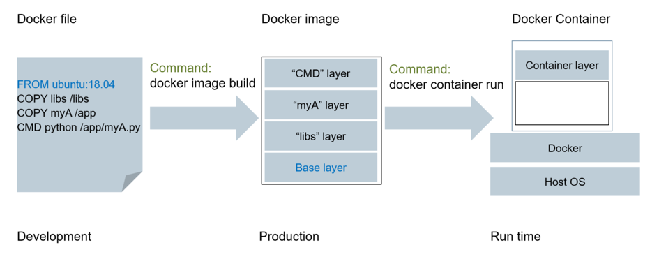

# Containers

## Definitions and Terms

Discussions around containers contains many terms, some of which can mean more than one thing depending on their context. In particular the terms 'image' and 'layer' are often interchangeable, but also sometimes mean specifically different things. This document tries to avoid any confusion by defining and using the following terms:

### Base (scratch) Image
A base Image is composed of only a single layer, with either no parent 'FROM' or the 'scratch' layer to overlay upon

### Base Layer
In a non 'Multi-stage' Dockerfile, the base layer ('FROM') that the Dockerfile builds upon

### Container
An instantiation of an Image via a container orchestration stack or runtime such as Docker or Kubernetes. Besides the image a container includes runtime data, i.e. data which are generated and/or modified during runtime, the layer which holds these data is the so-called container layer

### Dockerfile
A text file that defines the steps needed to form the layers of an Image. It contains all instructions needed to build a certain docker image. It can be seen as the makefile for a docker image

### Hub
See ['Registry'](#Registry)

### Image
A set of directories or files composited from one or more Layers overlaid on top of each other. The definition of an Images layers is derived from its Dockerfile. An image is a file consisting of a stack of layers. It can be viewed like an software image for e.g. an embedded device. Each layer consists of one or more binary packages, config files, environment variables etc.. 

It is an appliance which includes the application and everything the application needs to run. To be differentiated from a 'tarball image' or 'pushing an image' to a Hub

### Layer
A definition of files to be overlayed onto another layer, except for the case of a 'BASE image', that has no parent Layer to overlay onto

### Multi-stage
Since Docker v17.05, Dockerfiles, and thus Images, can contain multiple 'FROM' lines, and thus be derived from multiple Base Layers

### Parent Image
An image's parent image is the image designated in the FROM directive in the image's Dockerfile. All subsequent commands are applied to this parent image. A Dockerfile with no FROM directive has no parent image, and is called a base image.

### Pushing an Image
The act of 'pushing' an Image to a Registry. In reality, all the layers the Image is composed of are pushed to the Registry (for verification), and only new layers that do not already exist on the Registry are updated and stored there

### Registry
A server/service used to upload, store and retrieve container Images. In reality, a registry works with and stores Layers

### Tarball (Image)
A single tar file comprising of all the layers that make up an Image. Generated with a 'docker save'

### Tarball (container)
A single tar file comprising of all the layers that make up a 'Container', squashed into a single Layer. Generated with a 'docker export'

## More information

There are usually three types of container-related deliveries.

### Dockerfiles

Dockerfiles are text files that describe how to build container images. They do not themselves contain any other software but instruct the building tooling to fetch software and/or manipulate the existing configuration to produce an image.

The following example Dockerfile would produce a Clear Linux based Linux image with the git tool installed:

FROM clearlinux:base
RUN swupd update && swupd bundle-add git

### Container Image (layers)

The container image layers composited from a Dockerfile. The image is composed of one or more layers, and of particular interest is what layers you have added, and which, if any, layers (images) you have based your image upon (the FROMs in your Dockerfile).

### Container tarfile Images

These are generated from a docker 'export' or 'save'. A full disk image of a container including all the components (layers).  Not to be confused with the executable container images produced locally by the tooling for local container execution.

