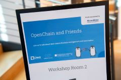

# OpenChain and Friends 2026 – An Open Source Management and Community Event
### #openchainandfriends

Save-the-date:

**Tuesday, march 24th to Thursday 26th of march 2026**
 
**24.3.-26.3.2026**
 
**in Stuttgart**
 

Again with the idea to grow the Open Source Community in Stuttgart/Baden-Württemberg – along the motto “Supply Chain (Chances and) Risk Management” and beyond.

-	Tuesday, march 24th 2026
    *	main event day including marketplace -  probably in Stuttgart Feuerbach,
    *	socializing event in the evening
-	Wednesday / Thursday, march 25th / 26th 2026
    *	rooms for community organized events, unconference, maybe Hackathons?
    *	“We provide the stage, you provide the topics”

## Impressions from 2025
- LinkedIn: [#openchainandfriends](https://www.linkedin.com/search/results/all/?keywords=%23openchainandfriends)
- OpenSource.bosch.com [OpenChain & Friends: Stuttgart Success](https://opensource.bosch.com/stories/openchain-event-and-eastern-europe-initiative/)

