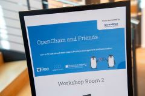

# OpenChain and Friends 2026 – An Open Source Management and Community Event
### #openchainandfriends

Registration is free but mandatory: >>> [Registration HERE](https://teilnehmen.e-mobilbw.de/) <<<
*(Please actively select/de-select the topics you plan to attend or not, we will only consider your registration for the actively selected tracks on a first come first serve base. By submitting your registration you confirm to follow the [event code of conduct](https://github.com/Open-Source-Compliance/Sharing-creates-value/blob/openchain_and_friends_2026_prep/Events/OpenChainAndFriends26/event_code_of_conduct.md).)*

**Tuesday, march 24th to Thursday 26th of march 2026**    
**24.3.-26.3.2026**     
**in Stuttgart**    

Again with the idea to grow the Open Source Community in Stuttgart/Baden-Württemberg - together with [The FOSS-LÄND Community](https://github.com/the-foss-laend) – along the motto “Supply Chain (Chances and) Risk Management” and beyond.
*“We provide the stage, you provide the topics”*

## Event outline

---  
  
### Tuesday, march 24th 2026

**Stuttgart Feuerbach**

*	09:00 AM CET Opening and Badge Pickup
* 10:00 AM CET Welcome and Keynotes
  * Keynote and Panel on Open Source Opportunities and [Digital Sovereignty & Open Source in Business](#digital-sovereignty-and-open-source-in-business) <a name="t1_k1">
  * Keynote on [Embedded and Open Source Hardware](#embedded-and-open-source-hardware) <a name="t1_k2">
* 11:30 Event Overview and Marketplace Opening
*	02:00 PM CET Afternoon Tracks
    *	**T1.1**	[Education](#education) <a name="t1_1">
    *	**T1.2** [Open Source Compliance and OSPO Topics](#open-source-compliance-and-ospo-topics) <a name="t1_2">
    *	**T1.3** [Digital Sovereignty & Open Source in Business](#digital-sovereignty-and-open-source-in-business) <a name="t1_3">
* 04:00 PM CET Afternoon Tracks
  * **T1.4** [Artificial Intelligence](#artificial-intelligence) <a name="t1_4">
  * **T1.5** [CyberSecurity](#cybersecurity) <a name="t1_5">
  * **T1.6** [Automotive / SDV](#automotive--sdv) <a name="t1_6">
*	06:30 PM CET socializing event in the evening
   
### Wednesday, march 25th 2026

**Stuttgart Feuerbach**

*	 10:00 AM CET **T2.1** [Embedded and Open Source Hardware](#embedded-and-open-source-hardware) Full-Day Track <a name="t2_1">
*	 10:00 AM CET **T2.2** [Artificial Intelligence](#artificial-intelligence) Full-Day Track <a name="t2_2">
*	 05:30 PM CET [Women in Open Source](#women-in-open-source) Network Meeting <a name="t2women">

**Ludwigsburg**

*	09:00 AM CET **T2.3**  [Open Source Compliance and OSPO Topics](#open-source-compliance-and-ospo-topics) Full-Day Track <a name="t2_3">

**Vaihingen**

* 09:00 AM CET **T2.4** Industry4.0 / Robotics /ROS Full-Day Track	<a name="t2_4">

### Thursday, march 26th 2026

**Stuttgart Feuerbach**

*	09:00 AM CET **T3.1** [CyberSecurity](#cybersecurity) Full-Day Track <a name="t3_1">
*	09:00 AM CET **T3.2** Cross-Innovation and community unconference <a name="t3_2">
	
**Ludwigsburg**

*	09:00 AM CET **T3.3** [Automotive / SDV](#automotive--sdv) Full-Day Track <a name="t3_3">

**Vaihingen**

*	09:00 AM CET **T3.4** [Education](#education) Full-Day Track <a name="t3_4">

*Please note: as with everything in the OpenChain Project, this event belongs to the community. Our schedule is created in collaboration with the people who will attend, and therefore you should feel free to make suggestions:
[Topic_backlog.md](Topic_backlog.md)*

  
---  
  	  
## Topic streams confirmed as of 16.01.2025
### Artificial Intelligence
*The topic stream AI will cover at least the following aspects:*
1.	***AI Systems Engineering**: methodology and open source tools to ensure a systematic engineering for the development and operation of AI systems, especially in complex technical and environments. Background information at https://www.ki-engineering.eu/en/know-how-tools.html .*
2.	***AI data platform**: open platform and open source tools for the search for and retrieval of AI assets (datasets and AI models). Ideas at  https://github.com/KI-Allianz .*
3.	***Open AI agents** for resilient and sustainable supply chains, e.g., Manufacturing as a Service (MaaS) as elaborated in the project Factory-X, see https://www.iosb.fraunhofer.de/en/projects-and-products/factory-x.html#1326726683 .*
4.	***AI SBOMs and Guidance**: https://openchainproject.org/news/2025/10/20/welcoming-the-openchain-ai-system-bill-of-materials-compliance-guide*

[go to schedule Day1](#t1_4) [go to schedule Day2](#t2_2) 

### Cybersecurity
*The topic stream Cybersecurity will cover at least the following aspects:*    
*Good Practice Sharing and Discussions about CyberSecurity challenges in the Software Supply Chain around new technologies like AgenticAI, regulations like CRA, SBOM requirements,... and how the ISO18974 and the OpenChain SBOM Workgroup can help organizations to prepare for it.*
[go to schedule Day1](#t1_5) [go to schedule Day3](#t3_1) 

### Open Source Compliance and OSPO-topics
*The topic stream Open Source Compliance and OSPOs will cover the following aspects:*    
1.	***Building and Scaling OSPOs**: methodologies, best practices, and organizational patterns for establishing and maturing Open Source Program Offices to support strategic open-source adoption and collaboration.*
2.	***Compliance Processes and Tooling**: open source tools, automation approaches, and governance workflows to ensure license compliance, security readiness, and transparent software supply chain management including recent non-functional requirements (NFR) from regulations (e.g. CRA,...).*
3.	***Real-World Implementations**: real life examples for community or company driven initiatives demonstrating how effective OSPO governance enables innovation, reduces risk, and strengthens responsible open source participation across industries.*

[go to schedule Day1](#t1_2) [go to schedule Day2](#t2_3) 

### Women in Open Source
*The topic stream Women in Open Source will prepare a women network meeting and will additionally contribute expertise in all other topic streams.*  
[go to schedule Day2](#t2women) 

### Embedded and Open Source Hardware   
*This track explores the complete hardware production lifecycle, from semiconductor manufacturing and packaging, to simulation and development. We'll focus on open source solutions and local capabilities, aiming to spark new collaborations and boost awareness within the community for these exciting, ongoing projects*

1. ***Best practices for source code disclosure for System-on-Chips (SoCs)**: The comprehensive open source hardware guide – from contributing to open source hardware and simulating/architecting your custom chip, to building a commercial Chip or SoC with open-source IP. Plus, discover essential simulation and verification strategies along the way.*
2. ***Opportunities for SMEs in the European Semiconductor sector – the European Silicon Renaissance: Can We Build Chips Domestically or Do We Need Global Partners?**: This session reveals how to tap the deep reservoir of innovative semiconductor and tooling companies right here in Europe, illuminating the cutting-edge solutions originating from the region and Europe more widely, and exploring the ambitious path toward European chip sovereignty. While a single day can only scratch the surface, it marks the crucial starting point for understanding and celebrating the Continent's technological independence.*
3. ***Handling licenses and sharing IP with the community**: Developing a commercial Chip or SoC with open source IP presents unique challenges. How do you maintain an actively developed commercial product while relying on community dependencies? Join us for a lively exchange of ideas to explore these critical questions.*
 
[go to schedule Day1](#t1_k2) [go to schedule Day2](#t2_1) 

### Digital Sovereignty and Open Source in Business
*The topic stream Digital Sovereignty and Open Source in Business will cover the following aspects:*    
*Open Source as competitive factor in the business of private sector companies, collaboration opportunities between private and public sector and the status of the collaboratively developed Open Source in Business Guide.*  
[go to schedule Keynote Day1](#t1_k1) [go to schedule Day1](#t1_3) 

### Education
*The topic stream Education will cover the following aspects:*    
•	*Overview, status and future plans of **publicly available Open Source training material***  
•	*Workshops to work on the **next generation of training** including new presentation technologies, new areas*  
•	***Case studies and best practices***  
•	***Demos, simulations, “getting started” workshops** for available **Open Source infrastructure, tools, initiatives**.*  
•	*“Ask me anything” drop-in sessions*  
[go to schedule Day1](#t1_1) [go to schedule Day3](#t3_4) 

### Automotive / SDV
*The topic stream Automotive and SDV will cover the following aspects:*    
*[The Automotive Collection](https://github.com/ariexi/the-automotive-collection) and deep-dives in specific projects with interesting supply-chain aspects,   business opportunities for small- and medium-sized enterprises around them and topics from the last [OpenChain Automotive Workgroup meeting](https://github.com/OpenChain-Project/Automotive-WG/blob/main/2025-11-workshop-agenda.md) like Automotive SBOM activities.*  
[go to schedule Day1](#t1_6) [go to schedule Day3](#t3_3) 

*further topics in clarification and still open for proposals!*

## Impressions from 2025
- LinkedIn: [#openchainandfriends](https://www.linkedin.com/search/results/all/?keywords=%23openchainandfriends)
- OpenSource.bosch.com [OpenChain & Friends: Stuttgart Success](https://opensource.bosch.com/stories/openchain-event-and-eastern-europe-initiative/)

