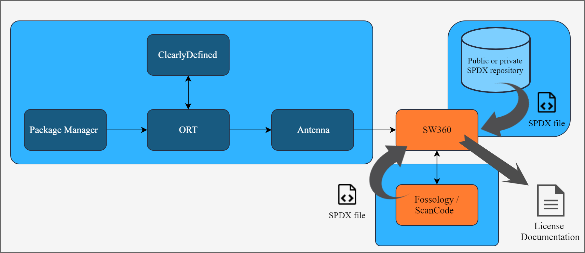

# Follow-up: OSS Compliance 2.0

I decided to write another blog post as Verifa’s approach for open source compliance has evolved quite a bit since my previous [post](https://medium.com/verifa/oss-compliance-4e3822757c5) from last year. My former colleague Adam Mackay also wrote an awesome [blog post](https://medium.com/verifa/open-source-compliance-in-the-devops-world-cf3167b880e9) about open source compliance in a more non-technical manner.

The current mainstream approach for solving enterprise-scale open source license compliance involves more and more open source tools and less commercial ones. This “open source compliance with open source tooling” ideology is also greatly supported by the community around different tools and initiatives. Programs like [oss-tooling-group](https://oss-compliance-tooling.org/) and [Double Open project](https://www.doubleopen.org/) are heavily driving checked this ideology in the industry. Verifa is involved in both of these initiatives.

One point that I want to explain in this post is the ways in which we can generate or collect licensing information, and how to re-use that efficiently and in an automated manner. There is one tool that I want to explicitly point out and that is [Eclipse SW360](https://github.com/eclipse/sw360). Adam and I have discussed this tool already in our previous posts, but for recap it is a software component metadata repository. This means that it heavily relies on the abstraction where software components are the smallest units and not the file. File-level processing is usually done in other tools and SW360 just incorporates that information under the abstraction of a component. One notable point in SW360 is that it is designed exactly for processing component metadata and license information and its data models and technical architecture are made to support those targets.

In the above, dark blue boxes present a fully automated tool-chain for license compliance. By fully automated I mean that all data is collected automatically and requires no human actions. The starting point is that we have a project that uses some package manager that is supported by [OSS-Review-Toolkit](https://github.com/heremaps/oss-review-toolkit) tool (ORT for short). It is a set of tools designed to be used for automating the processes around license compliance. In this diagram we use only ORT’s Analyzer module which is designed to identify a project’s dependencies as well as its transitive dependencies. One upcoming feature of ORT is an integration with [ClearlyDefined](https://clearlydefined.io/), which is a public API for license information for individual components. The main use-case for the ORT-ClearlyDefined integration is automatic curation of component metadata which was missing from the information the package manager provided. The next dark blue box in the tool-chain is [Antenna](https://github.com/eclipse/antenna). Antenna is sort of a spin-off project from SW360 and its main feature is that it can populate SW360’s database automatically using the API. Antenna can also do other processing like source code or license validation or policy checking. At the end of the tool-chain we have SW360 itself.

## How to achieve license information

We basically have two individual options to get license information into SW360. One way is to obtain metadata about software components from the automated tool-chain explained above. The other method is to use SPDX files, which are designed to include all necessary licensing information for a single component, a software package. One important thing here is that [SPDX](https://spdx.org/) files also rely on the component abstraction in the same way as SW360 and that is why reusing those files in SW360 makes a lot of sense. SPDX files are usually generated with file scanning tools like [Fossology](https://github.com/fossology/fossology) and [ScanCode](https://github.com/nexB/scancode-toolkit).

There can be two different strategies for producing SPDX files. The first and more obvious way is to create them as needed, so when new components are created in SW360 the clearing team gets notified and they’ll start file scanning. This way requires that there is, at least occasionally, a dedicated person/team who is responsible for clearing the components. The other way is to clear components upfront and then share the resultant SPDX files. This approach also requires manual work from a dedicated person or team, but the difference is that this approach expects that there are multiple parties who share SPDX files. The DoubleOpen project utilizes the latter approach and in their vision there would be public and corporate private SPDX file repositories available, and it would be a community effort to create those files for public repositories. This kind of approach however would require quite a big effort in the beginning to get the snow ball effect to start.

## Automation and ’Conan’ use-case

From the very beginning, Verifa’s target has been to add automation to software development processes as much as possible. Given the heterogeneous nature of 3rd party software licensing, it can be quite a difficult job to clear components reliably in a fully automated way. For this reason we want to use methods that help us to collect data about software components automatically. One of these methods is to use package managers. [Conan](https://conan.io/) is a Python based package manager for C/C++ projects and having it lets user access package meta-data in the world of modern C/C++, which has not been available before. In the picture above, we have a Jenkins CI/CD pipeline for the Conanized open source C++ library, [Folly](https://github.com/facebook/folly).

In the pipeline, first we need to build the project, install dependencies and collect metadata about components or Conan packages in this case. Next we run ORT Analyzer over the project. [ORT Analyzer integration with Conan](https://github.com/heremaps/oss-review-toolkit/pull/1883) (a.k.a. Conan Analyzer) was contributed by Verifa a while back. ORT Analyzer analyzes the package definition file, which in this case is `conanfile.py` or `conanfile.txt`. This file contains information about components used in the project. The third step is ORT Scanner. Before scanning can be performed, the source code for the components themselves must be downloaded. ORT Downloader automatically downloads source codes for the components and it is invoked implicitly when running ORT Scanner. ORT Scanner in turn uses ScanCode as a default file scanner, but other scanners are also supported. The scanner scans the components’ source code and generates a YML file based on scanner results. In the last step we pass all this gathered data to Antenna which populates SW360 accordingly.

When we have all our components identified and the metadata about them collected and imported into SW360, we can continue the process in case we do not only want to rely on the metadata collected from package managers and possibly curated from ClearlyDefined. At this point we can decide whether we want to supplement component metadata with licensing information from SPDX files. SPDX files can be created fully-automatically with ScanCode or Fossology, or some other license scanning tools that can export results to SPDX format. If we use Fossology we can also manually review scan results before exporting results, this feature gives some enterprise users the confidence that results are correct since a human has reviewed them. However this manual review process is expensive, error-prone and a step away from automation and therefore alternative approaches should be considered. Using SPDX files with SW360 is also useful because SW360 is able to parse them and generate product license documents based on them.

---

The solution that I have described in this post is a reference solution. As mentioned earlier, the world of open source compliance is extremely heterogeneous and we have seen in practice that usually we have to modify the compliance tool-chain from the reference one to match the specific requirements. The point is to show what kind of building blocks we have available and how they integrate together. The core principles in most use-cases are same; we have different analyzers that we use to collect information about components and to manage and aggregate all this data we have a component catalog. Using component catalog as an aggregation point also benefits enterprises with their internal processes as well as managing their 3rd party software usage. These are also development criteria for SW360.
