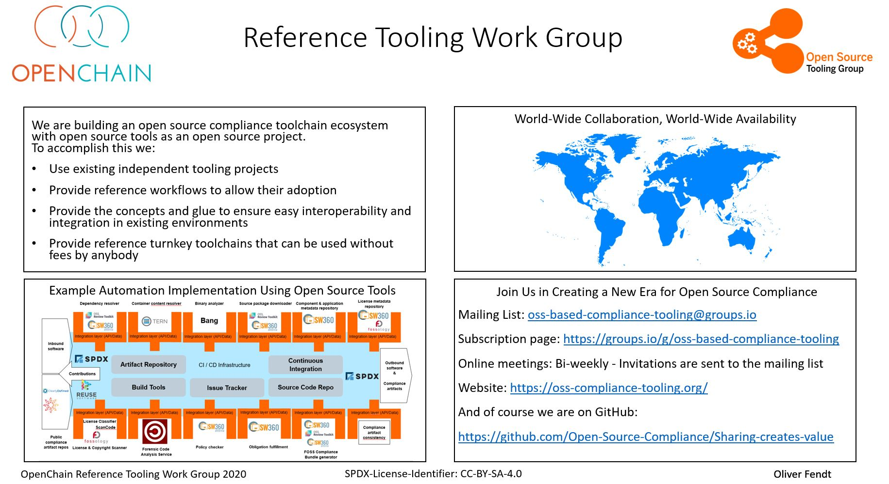

## Open Source Tooling for Open Source Compliance

## A Single Focus
This work group is focused on reducing resource costs and improving the quality of results around open source compliance activities. The work group uses open source principles to accomplish this. It is a meritocracy producing real world solutions for real world challenges and it shares results to all interested parties.

* We are making turn-key Open Source tooling for Open Source Compliance
* We are considering what open data database(s) can support this
* We plan to work with existing projects to make this happen (Bang, FOSSology, ORT, ScanCode, SPDX, sw360, SW360antenna, Tern and the online data from SW Heritage and ClearlyDefined)

This activity is part of the OpenChain Project. Here is a brief description of the hierarchy:

* The [OpenChain Project](https://www.openchainproject.org) maintains the standard for open source compliance in the supply chain. It also provides reference material and collaborative activities in this field.

* The OpenChain Project has various Work Groups where volunteers work on specific compliance challenges. Some Work Groups like Automotive and Tooling are global, some like the Japan Work Group are local.

* The OpenChain Project Tooling Work Group is using the Sharing Creates Value GitHub Repository and OSS Compliance Tooling mailing list to coordinate activity around open source compliance tooling.

## In a Nutshell

Our goal is to provide OSS cmpliance reference toolchains licensed under an OSS compliant licensed.

You can learn more on our [Github space]( https://github.com/Open-Source-Compliance/Sharing-creates-value/)
